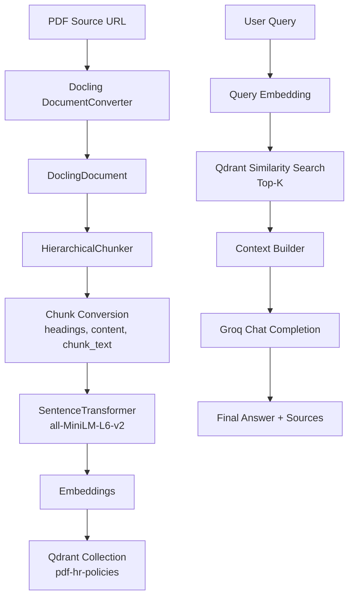
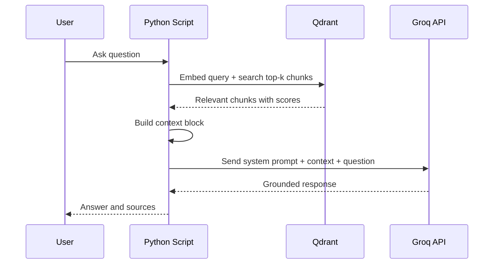

## Python RAG with Docling + Qdrant + Groq

This project builds a Retrieval-Augmented Generation (RAG) pipeline for HR policy QA using:

- Docling for PDF parsing
- Hierarchical chunking for structured chunks
- Sentence Transformers for embeddings
- Qdrant for vector storage and retrieval
- Groq LLM for final answer generation

The main flow is implemented in [01_rag/python_rag_docling.py](01_rag/python_rag_docling.py).

## End-to-End Flow



## Request/Response Diagram



## What Is Already Working

- PDF is fetched and parsed from a remote URL.
- Chunks are generated with section-aware structure.
- Chunks are embedded and indexed in Qdrant.
- Retrieval returns top-k relevant chunk payloads.
- RAG generation works with Groq after valid API key setup.

## Project Structure

```text
python-rag-docling/
  main.py
  pyproject.toml
  README.md
  01_rag/
	python_rag_docling.py
	.env
```

## Prerequisites

- Python 3.11+
- Qdrant running locally on port 6333
- A valid Groq API key

## Setup

1. Install dependencies:

```bash
uv sync
```

2. Add your Groq key in [01_rag/.env](01_rag/.env):

```env
GROQ_API_KEY=gsk_your_real_key_here
```

3. Start Qdrant (example with Docker):

```bash
docker run -p 6333:6333 qdrant/qdrant
```

## Run

From repo root:

```bash
uv run 01_rag/python_rag_docling.py
```

Or from inside [01_rag](01_rag):

```bash
uv run python_rag_docling.py
```

## RAG Pipeline Steps

1. Load and parse PDF via Docling.
2. Convert document into hierarchical chunks.
3. Build embed-ready text using breadcrumb + content.
4. Create embeddings for each chunk.
5. Recreate Qdrant collection and upsert all points.
6. On query:
   - Embed query
   - Retrieve top-k chunks from Qdrant
   - Build context from retrieved chunks
   - Ask Groq model with strict grounding prompt
7. Return generated answer and sources.

## Configuration Points

- `SOURCE`: input PDF URL
- `EMBEDDING_MODEL`: embedding backbone (currently `all-MiniLM-L6-v2`)
- `COLLECTION_NAME`: Qdrant collection name
- `GROQ_MODEL`: LLM used for answer generation
- `top_k`: retrieval depth

## Troubleshooting

### 401 Invalid API Key

If you see `groq.AuthenticationError: ... invalid_api_key`:

- Regenerate a new key from Groq dashboard.
- Ensure [01_rag/.env](01_rag/.env) contains exactly `GROQ_API_KEY=...`.
- Avoid extra spaces or `Bearer ` prefix in the key value.

### Key Not Picked from .env

The script now loads `.env` using a path relative to the script file, so it does not depend on where the command is run from.

### Qdrant Connection Error

- Ensure Qdrant is running on `localhost:6333`.
- Confirm no firewall or Docker port mapping issues.

## Notes

- `recreate_collection` resets the collection each run.
- This script is designed as a clear learning flow and can be modularized later into ingestion and query services.
